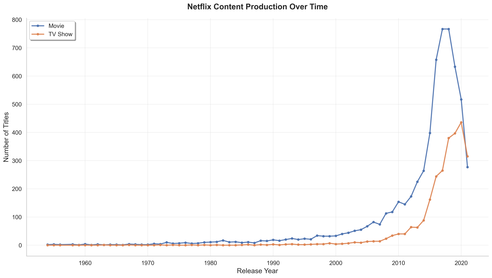
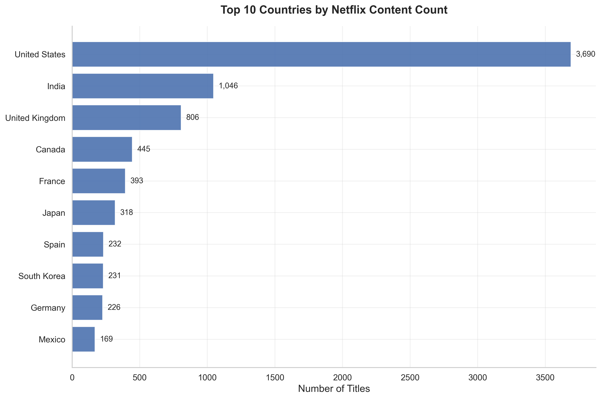
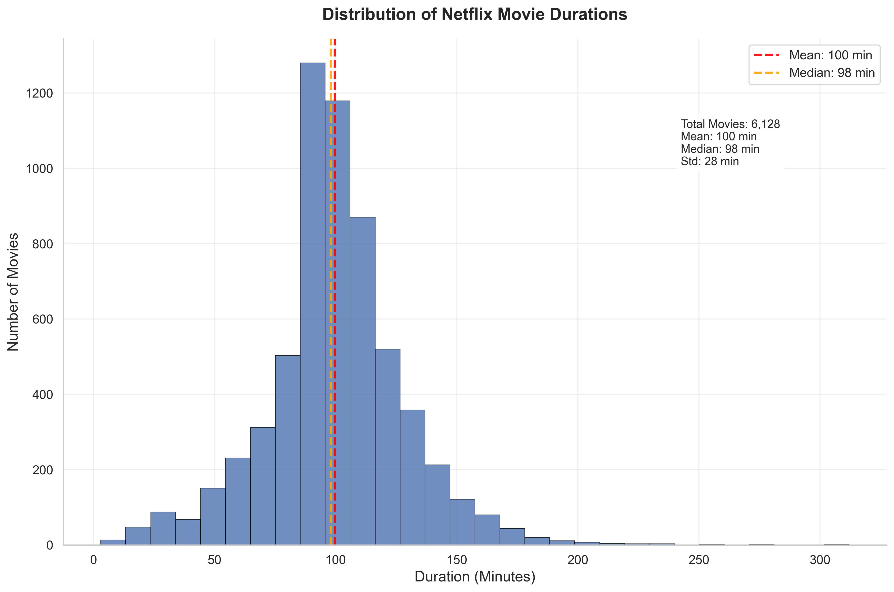

# Netflix Movies & TV Shows EDA

This repository contains the group project for **TDW6323 Data Wrangling and Visualisation**.  
The project applies data wrangling and visualisation techniques to the [Netflix Movies and TV Shows dataset](https://www.kaggle.com/datasets/shivamb/netflix-shows).

---

## 📊 Project Structure

```
├── data/
│   ├── raw/
│   │   └── netflix_titles.csv         # Original dataset (from Kaggle)
│   └── processed/
│       ├── netflix_clean.csv          # Cleaned dataset
│       ├── netflix_exploded.csv       # Exploded version (multi-value fields expanded)
│       ├── netflix_mlb.csv            # Multi-hot encoded version
│       └── quality_report.csv         # Data quality report
├── figures/                           # Generated plots
│   ├── content_by_year.png
│   ├── content_heatmap.png
│   ├── top_countries.png
│   ├── top_genres.png
│   ├── movie_duration_distribution.png
│   ├── duration_by_type.png
│   └── duration_vs_year.png
├── notebooks/
│   ├── 01_wrangling.ipynb             # Data cleaning and preprocessing
│   ├── 02_eda.ipynb                   # Exploratory data analysis
│   └── 03_visualisation.ipynb         # Visualisation
├── src/
│   ├── clean.py                       # Data cleaning functions
│   ├── plot.py                        # Plotting functions
│   ├── utils.py                       # Utility functions
│   └── main.py                        # Main pipeline runner
├── requirements.txt                   # Project dependencies
└── README.md                          # Project documentation
```

---

## ⚙️ Setup

1. Clone this repository:
   ```bash
   git clone https://github.com/Nicholas1025/DATA-WRANGLING-AND-VISUALISATION.git
   cd netflix-eda-project
   ```

2. Install dependencies:
   ```bash
   pip install -r requirements.txt
   ```

3. Run the pipeline:
   ```bash
   # Clean dataset + generate processed files
   py -m src.main --step clean

   # Generate all visualisations
   py -m src.main --step viz
   ```


---

## 📌 Research Questions (RQ)

- **RQ1:** How has the ratio of movies to TV shows changed over time?  
- **RQ2:** Which countries produce the most movies and TV shows on Netflix?  
- **RQ3:** What is the distribution of movie durations, and is there a common “mainstream” range?  
- **RQ4:** Which genres appear most frequently in Netflix’s catalogue?  

---

## 🖼️ Sample Outputs

- Content Trends Over Time  
  

- Top Producing Countries  
  

- Movie Duration Distribution  
  

---

## 👩‍💻 Authors

- Group Project for **TDW6323 Data Wrangling and Visualisation**  
- Multimedia University, 2025  
